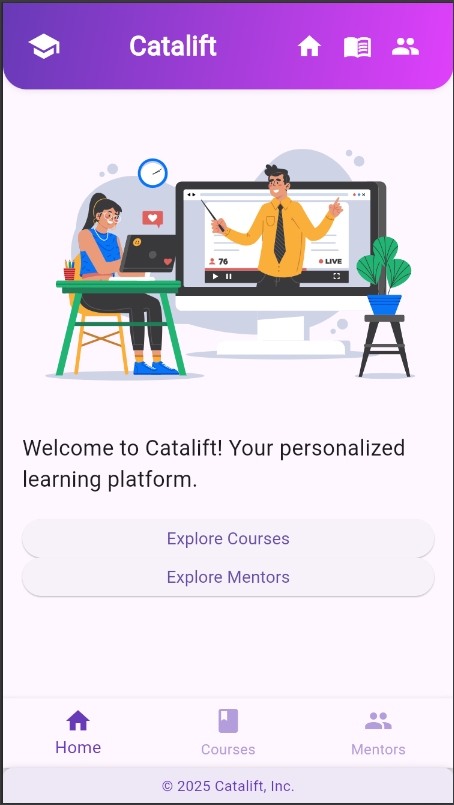
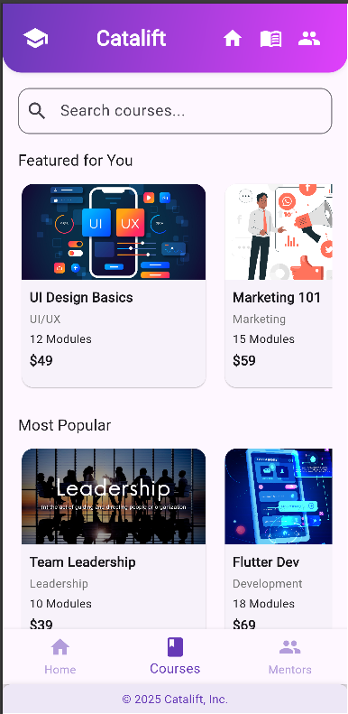
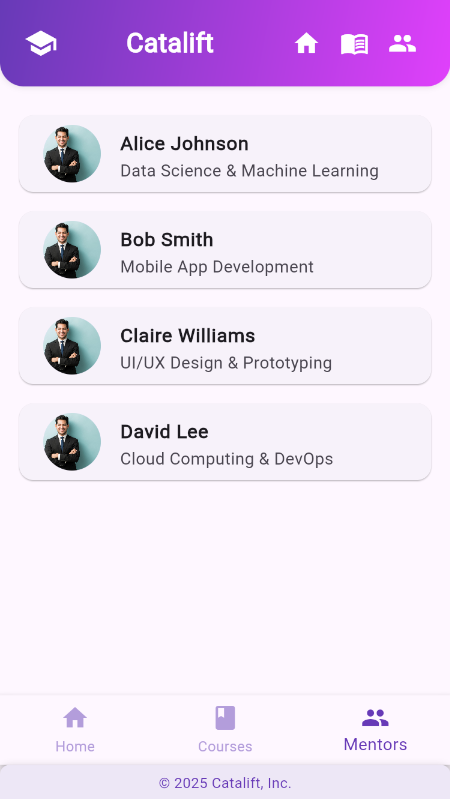

# Catalift Flutter App

A sleek, modular Flutter app for browsing **courses**, **mentors**, and navigating between sections. Built using modern UI patterns with scrollable sections, image assets, and category-based filtering.

---

## ✨ Features

### 🏠 Home Screen
- Beautiful animated Lottie integration (based on shared design).
- Shared header and bottom navigation layout.

### 📚 Courses Screen
- **Horizontal scrollable sections**:
  - **Featured for you**
  - **Most Popular**
- **All Courses** (vertically listed).
- **Search and Filter** by category (UI/UX, Marketing, Development, Leadership).
- Each course includes:
  - Thumbnail image
  - Title, type, duration, and price
- UI ensures proper layout and no overflow with scrollable cards.

### 👩‍🏫 Mentors Screen
- List of mentors with:
  - Image
  - Name
  - Area of expertise
- Clean card layout with icons.

### 🔍 Navigation
- Persistent bottom navigation bar to switch between:
  - **Home**
  - **Courses**
  - **Explore Mentors**

---
## 📷 Screenshots

### 🏠 Home Screen


### 📚 Courses Screen


### 👩‍🏫 Mentors Screen


---

## 🛠️ How to Run

1. **Clone the repo**
   ```bash
   git clone https://github.com/yourusername/catalift_flutter.git
   cd catalift_flutter
Install dependencies

bash
Copy
Edit
flutter pub get
Add Assets

Place your course and mentor images in:

bash
Copy
Edit
assets/images/
Update pubspec.yaml:

yaml
Copy
Edit
flutter:
  assets:
    - assets/images/
Run the app

bash
Copy
Edit
flutter run
📌 Notes
Lottie animation integration assumed in the home screen.

UI based on SVG layout reference shared by design.


📄 License
This project is developed as part of an internship/hiring task and is private to the Catalift team.

yaml
Copy
Edit

---

Would you like me to export it as a `.md` file too?
